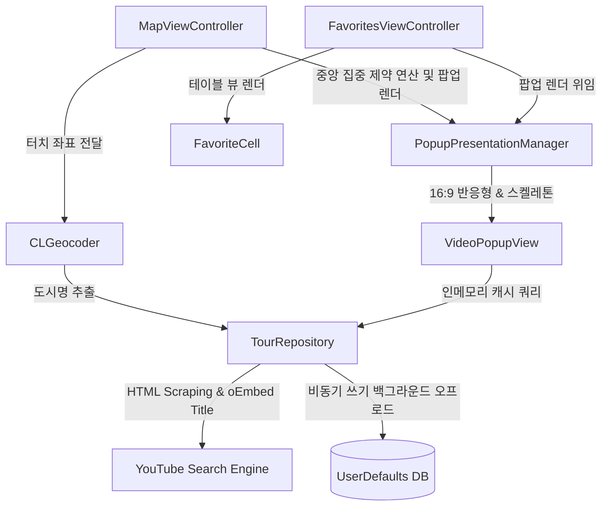

# LiveMapTour 🗺️
> 지도를 기반으로 실시간 세계 랜선 여행을 떠나고, 나만의 여행 보관함을 관리하는 iOS 어플리케이션

 

## 1. 프로젝트 수행 목적

### 1.1 프로젝트 정의
- **LiveMapTour**는 지도(MapKit)와 유튜브 실시간 도보 여행(Walking Tour) 콘텐츠를 유기적으로 결합하여, 사용자가 지도 위 특정 지점을 롱프레스하는 것만으로 그 지역의 생생한 현장 영상을 즉각적으로 즐길 수 있게 하는 가상 랜선 여행 서비스입니다.

### 1.2 프로젝트 배경
- 코로나 이후 오프라인 여행 대신 유튜브를 통한 '랜선 여행'(도보 여행 브이로그, ASMR 등)에 대한 수요가 크게 증가하였습니다. 그러나 매번 유튜브 앱을 켜서 직접 "런던 도보 여행", "파리 걷기 영상" 등 검색어를 입력하고 연관된 지리 정보를 매핑하는 것은 직관적이지 못하고 번거롭습니다.
- 사용자가 세계 지도를 보며 "이 지역은 실제로 어떻게 생겼을까?" 하는 호기심이 생겼을 때, 지도 위를 1초간 꾹 누르는 직관적인 액션 하나만으로 즉각 해당 지역의 1인칭 시점 도보 여행 콘텐츠를 찾아내 매핑해 줌으로써 극강의 편리함과 현장감 넘치는 경험을 제공하고자 개발되었습니다.

### 1.3 프로젝트 목표
- **즉각적인 인터랙션 피드백**: 터치 물결 파동 효과(Ripple Wave)와 스켈레톤 로딩(Shimmer UI)을 도입하여 지오코딩 및 크롤링 대기 시간 동안 사용자가 멈춤이 없는 부드러운 화면 전환 효과를 느끼게 함.
- **안정적 미디어 스트리밍**: iOS 14.5 및 WebKit 엔진의 최신 보안/임베드 제한(Error 153)을 우회하고, 탑프레임 리다이렉션을 차단하여 안전하고 온전한 16:9 비율의 임베디드 웹 플레이어 구현.
- **고성능 데이터 관리**: 앱 내 즐겨찾기 상태 판단 시 발생하는 UserDefaults 디스크 입출력 지연을 0ms 수준으로 수렴시키기 위해 메모리 캐시 및 백그라운드 비동기 쓰기 구조 구현.

---

## 2. 프로젝트 개요

### 2.1 프로젝트 설명
- 지도를 길게 누르면 `CoreLocation` 지오코더가 GPS 좌표를 분석해 한글 행정구역명을 반환하며, 이를 토대로 유튜브 실시간 크롤링 엔진이 최적의 Walking Tour 영상을 찾아냅니다.
- 탐색하는 동안 은은한 쉬머 로딩 상태의 팝업 카드가 띄워지고, 로드가 완료되면 타이틀과 주소, 즐겨찾기 등록 버튼 및 미디어 플레이어가 페이드온됩니다.
- 즐겨찾기 보관함을 통해 나만의 랜선 여행 목록을 안전하게 로컬 저장소에 보관하고 삭제할 수 있으며, 이 모든 동작은 비동기로 처리되어 대용량 보관 시에도 성능 끊김 없이 부드럽게 UI가 반응합니다.

### 2.2 프로젝트 구조
- 본 프로젝트는 엄격한 **단일 책임 원칙(SRP)**을 준수하여 Massive View Controller를 해소하고 완전히 격리된 컴포넌트 아키텍처를 가집니다.

### 2.3 결과물
- **메인 화면 (지도 뷰)**: MapKit 지도 위에 커스텀 카드 스타일의 흰색 어노테이션 핀이 부드럽게 팝업되는 프리미엄 지도 렌더러.
- **물결 및 쉬머 로딩**: 롱프레스 터치 시 CAShapeLayer 파동이 방출되며 스켈레톤 홀더 카드가 즉시 튀어나와 대기 시간을 체감상 최소화.
- **반응형 플레이어 팝업**: 16:9 최적 해상도로 유튜브가 임베드되어 UI 찌그러짐이 없고, 뒷배경이 비치는 프리미엄 블러 글래스모피즘(Glassmorphism) 연출.
- **즐겨찾기 보관함**: 테이블뷰 형태로 저장된 목록을 쾌적하게 한눈에 보여주고 밀어서 삭제(Swipe-to-delete) 기능을 완벽히 탑재한 보관소.

### 2.4 기대효과
- 텍스트 검색에 익숙하지 않거나 귀찮음을 느끼는 유저들이 직관적인 맵 롱탭 인터랙션만으로 전 세계 명소의 도보 영상을 바로 감상.
- 디바이스의 Main Thread 병목을 완벽히 제거하여 보관함의 데이터가 수백 개로 늘어나더라도 60fps에 준하는 매끄러운 스크롤링과 동작 보장.
- 가상환경(VMware) 및 구형 OS 버전(iOS 14.5)까지 완벽하게 지원하는 높은 엔진 호환성.

### 2.5 관련 기술
| 구분 | 설명 |
| :--- | :--- |
| **MapKit & CoreLocation** | 애플 공식 지도 연동 및 위경도 좌표의 행정구역 역지오코딩 분석. |
| **WebKit Sandbox & BaseURL Bypass** | WKWebView의 iframe 주입 및 baseURL 우회를 통해 YouTube 임베드 오류 153 극복 및 탑프레임 리다이렉트 현상 원천 차단. |
| **Thread-Safe In-Memory Caching** | O(1) 해시 룩업을 활용하여 메인 스레드 대기 현상을 타파하고, 백그라운드 비동기 직렬 쓰기를 적용한 고성능 DB 설계. |
| **CoreAnimation (CAShapeLayer)** | 터치 좌표 기반의 동적 물리 리플 파동 링 그래픽 가속 연출. |

### 2.6 개발 도구
| 구분 | 설명 |
| :--- | :--- |
| **Xcode 12.5 (Swift 5.0)** | 애플 생태계 표준 IDE 및 Swift 객체 지향형 개발 랭귀지. |
| **Apple iOS 14.5 Simulator** | 구형 WebKit 엔진 및 프레임 레이아웃 테스트를 위한 가상 시뮬레이션 환경. |
| **Git & GitHub** | 코드 형상 관리 및 마크다운 문서 영구 보관소. |
